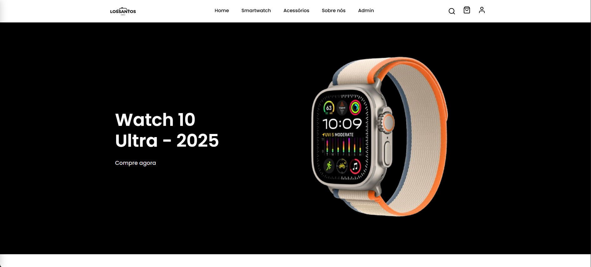

<!-- PORTFOLIO-FEATURED
title: Projeto Integrador – Smartwatch Store
description: E-commerce desenvolvido como Projeto Integrador, com foco em lógica, rotas, consumo de API e estruturação da aplicação. Construído em React e integrado a um back-end de exemplo para listagem e gerenciamento de produtos.
technologies: React, Vite, JavaScript, React Router, Axios
demo: https://site-smartwatch-pi.vercel.app/
highlight: true
image: public/foto.png
-->


<p align="center"> 
   
</p>


# Smartwatch Store

Projeto de e-commerce de smartwatches desenvolvido com React + Vite.

## 🚀 Tecnologias

- **React 19** - Biblioteca para interfaces
- **Vite** - Build tool e dev server
- **React Router DOM** - Roteamento
- **Axios** - Cliente HTTP
- **React Hot Toast** - Notificações

## 📁 Estrutura do Projeto

```
src/
├── components/     # Componentes reutilizáveis
├── pages/         # Páginas da aplicação
├── styles/        # Arquivos CSS
└── main.jsx       # Ponto de entrada
```

## ⚙️ Variáveis de Ambiente

O projeto usa variáveis de ambiente para configuração:

### Variáveis Disponíveis:
- `VITE_API_URL` - URL da API externa
- `VITE_APP_NAME` - Nome da aplicação
- `VITE_ADMIN_EMAIL` - Email do administrador

### Exemplo de uso:
```javascript
// Acessar variáveis de ambiente
const apiUrl = import.meta.env.VITE_API_URL || 'http://localhost:3001'
const appName = import.meta.env.VITE_APP_NAME || 'LOSSANTOS'

// Exemplo de chamada para API
const response = await axios.get(`${apiUrl}/products`)
```

## 🛠️ Desenvolvimento

### Instalação
```bash
npm install
```

### Scripts Disponíveis
```bash
npm run dev          # Servidor de desenvolvimento (localhost:5173)
npm run build        # Build para produção
npm run preview      # Preview do build
npm run lint         # Verificar código com ESLint
```

### Configuração Local
Crie um arquivo `.env.local`:
```
VITE_API_URL=http://localhost:3001
VITE_APP_NAME=Smartwatch Store
VITE_ADMIN_EMAIL=admin@lossantos.com
```

### React DevTools
Para uma melhor experiência de desenvolvimento, instale o React DevTools: <mcreference link="https://react.dev/link/react-devtools" index="0">0</mcreference>

**Opção 1: Extensão do Navegador (Recomendado)**
- [Chrome](https://chrome.google.com/webstore/detail/react-developer-tools/fmkadmapgofadopljbjfkapdkoienihi)
- [Firefox](https://addons.mozilla.org/en-US/firefox/addon/react-devtools/)
- [Edge](https://microsoftedge.microsoft.com/addons/detail/react-developer-tools/gpphkfbcpidddadnkolkpfckpihlkkil)

**Opção 2: Standalone (já instalado)**
```bash
react-devtools
```

## 🌐 Deploy

### Vercel (Recomendado)
1. Conecte seu repositório no [Vercel](https://vercel.com)
2. Configure as variáveis de ambiente no dashboard
3. Deploy automático a cada push

### Variáveis de Ambiente para Produção:
```
VITE_API_URL=https://sua-api-backend.com
VITE_APP_NAME=Smartwatch Store
VITE_ADMIN_EMAIL=admin@lossantos.com
```

## 📱 Funcionalidades

- ✅ Catálogo de produtos
- ✅ Sistema de login/cadastro
- ✅ Painel administrativo
- ✅ Gerenciamento de usuários
- ✅ Gerenciamento de produtos
- ✅ Interface responsiva
- ✅ Notificações toast

## 🔧 Configuração da API

O projeto está configurado para consumir uma API REST externa. Certifique-se de que sua API tenha os seguintes endpoints:

- `GET /users` - Lista usuários
- `POST /users` - Criar usuário
- `GET /products` - Lista produtos
- `POST /products` - Criar produto
- `GET /accessories` - Lista acessórios

## 📄 Licença

Este projeto é privado e destinado apenas para fins educacionais.

## Desenvolvimento

### Instalação:
```bash
npm install
```

### Desenvolvimento local:
```bash
npm run dev
# Acesse: http://localhost:5173
```

### Para extrair dados do db.json:
```bash
npm run extract-env
```

## Tecnologias
- React 19
- Vite
- React Router DOM
- Axios
- React Hot Toast
- Tailwind CSS (se configurado)
